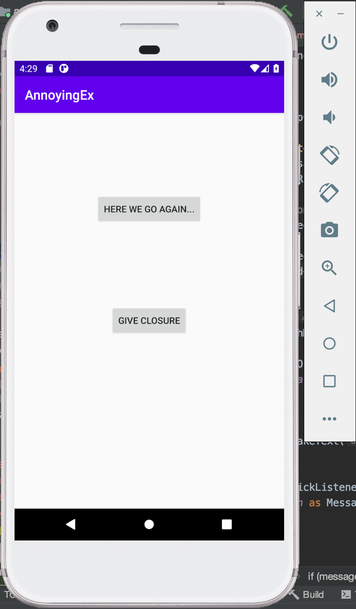
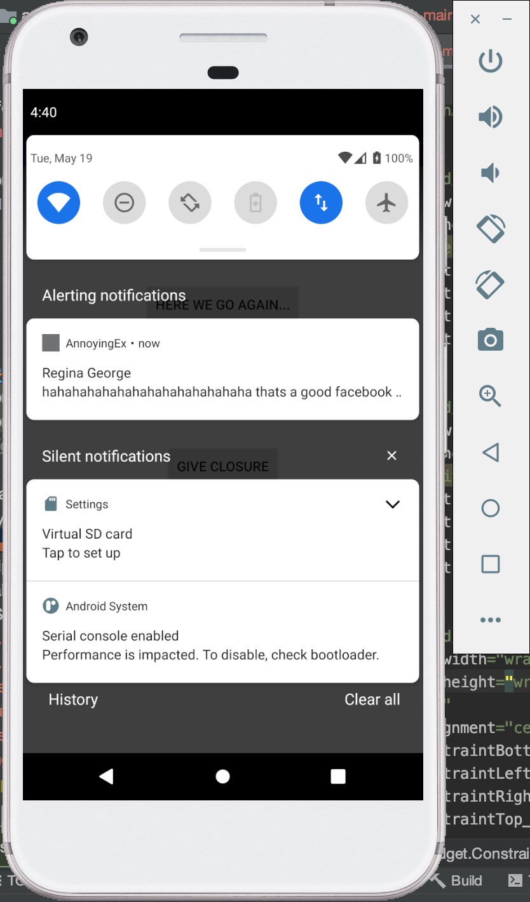
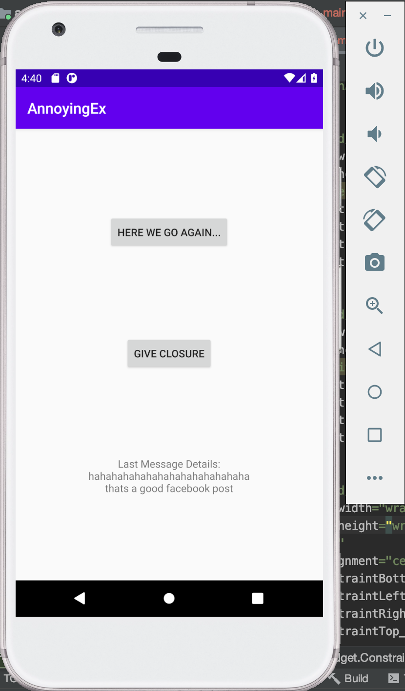

## INFO 448 HW 5 - AnnoyingEx Androiod App
### Lizzy Chen

### A. Briefly describes the app

Built on Andriod Studio, this application aims to fetch messages from certain "annoying-ex" people and ping notifications with the messages. So far the application has a couple of functions developed as listed below:
1. When initializing the app, the app will send an HTTP GET request to some url and receive the data provided. With the data, the app can show messages' contents from a certain "annoying-ex" whose name has been set to "Regina George". Main page of the app will show up when the app is initialized, where there are two buttons, “Here we go again...” button and "Give Closure" button

2. “Here we go again...” button that, when clicked, can start a repetitive notification task that runs independent regardless of the app is running or not. The task will start with a 5 second delay, run “roughly” every 20 minutes, and only run when the device on which the app is installed is charging

3. Specifically, the notification task will randomly select one of the messages from previously fetched and stored data and send the message as a notification. When clicked, the notification will automatically dismiss. Meanwhile, the main page of the app will be back on screen, where the content of the clicked message will be displayed

4. “Give Closure” button that, when clicked, will terminate ongoing work of the app

### B. Extra credit attempted

Extra credit question 1

### C. Shows photos or screenshots of your app running on a device/emulator

### Optional: Any special set up/installation instructions or how to use the app

N/A
